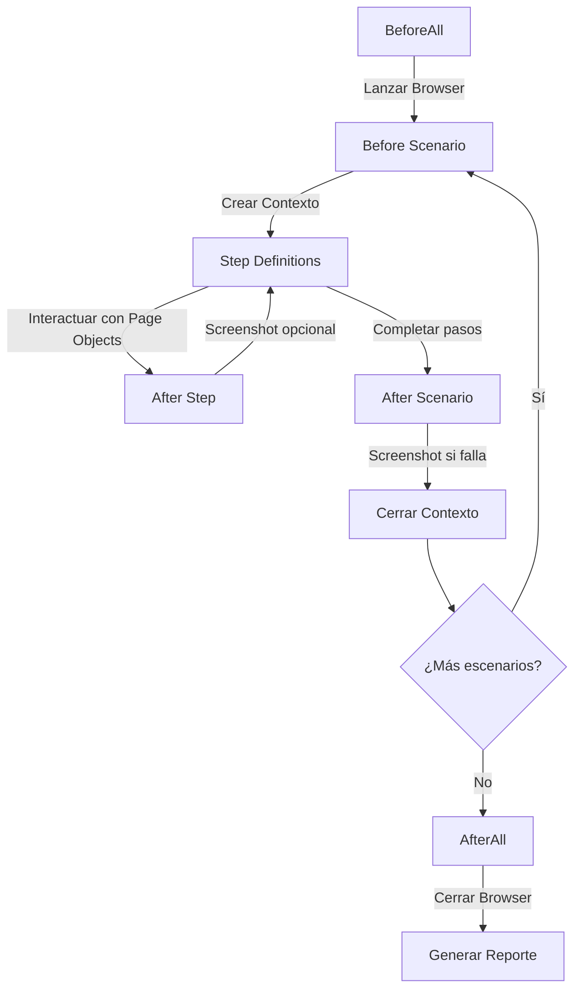

# 🏗️ Arquitectura del Proyecto - Paynova Test Automation

## 📋 Tabla de Contenidos
- [Visión General](#visión-general)
- [Stack Tecnológico](#stack-tecnológico)
- [Estructura de Directorios](#estructura-de-directorios)
- [Patrones de Diseño](#patrones-de-diseño)
- [Flujo de Ejecución](#flujo-de-ejecución)
- [Configuración](#configuración)
- [Reportes](#reportes)

---

## 🎯 Visión General

Proyecto de automatización de pruebas para **Paynova** usando **Playwright + Cucumber** con TypeScript, implementando el patrón **Page Object Model (POM)** para garantizar:
- ✅ Código mantenible y escalable
- ✅ Reutilización de componentes
- ✅ Separación de responsabilidades
- ✅ Reportes profesionales

---

## 🛠️ Stack Tecnológico

| Tecnología | Versión | Propósito |
|-----------|---------|-----------|
| **Playwright** | ^1.41.2 | Automatización de navegadores |
| **Cucumber** | ^10.0.1 | BDD Framework (Gherkin) |
| **TypeScript** | Latest | Type safety y mejor desarrollo |
| **Node.js** | 18+ | Runtime |
| **multiple-cucumber-html-reporter** | ^3.5.0 | Reportes HTML profesionales |

---

## 📁 Estructura de Directorios

```
tests/
├── config/                          # Configuraciones
│   ├── cucumber.js                  # Config principal de Cucumber
│   ├── cucumber.vida.js             # Config específica para VIDA
│   ├── cucumber.rrhh.js             # Config específica para RRHH
│   └── cucumber.login.js            # Config específica para Login
│
├── src/                             # Código fuente
│   ├── features/                    # Feature files (Gherkin)
│   │   ├── login.feature
│   │   ├── registrar-solicitud.feature      # RRHH
│   │   └── registrar-solicitud-vida.feature # VIDA
│   │
│   ├── pages/                       # Page Objects (POM)
│   │   ├── LoginPage.ts
│   │   └── RegistrarSolicitudPage.ts
│   │
│   ├── step-definitions/            # Step Definitions
│   │   ├── login.steps.ts
│   │   ├── registrar-solicitud.steps.ts
│   │   └── registrar-solicitud-vida.steps.ts
│   │
│   ├── hooks/                       # Cucumber Hooks
│   │   └── hooks.ts                 # Setup/Teardown
│   │
│   └── helper/                      # Utilidades
│       ├── browsers/
│       │   └── browserManager.ts    # Gestión de navegadores
│       ├── env/
│       │   └── env.ts               # Variables de entorno
│       ├── data-loader.ts           # Carga de test data
│       └── report.ts                # Generador de reportes
│
├── test-data/                       # Datos de prueba
│   ├── usuarios.json                # Usuarios por área
│   └── solicitudes.json             # Datos de solicitudes
│
├── test-results/                    # Resultados
│   ├── json/                        # JSON de Cucumber
│   └── reports/                     # HTML Reports
│
├── screenshots/                     # Screenshots de fallos
│
├── .env                            # Variables de entorno base
├── .env.uat                        # Variables de UAT
├── .env.dev                        # Variables de DEV
├── package.json                    # Dependencias y scripts
└── tsconfig.json                   # Config de TypeScript

```

---

## 🎨 Patrones de Diseño

### 1. Page Object Model (POM)

Encapsula la lógica de interacción con las páginas en clases reutilizables.

**Ejemplo: `LoginPage.ts`**

```typescript
export class LoginPage {
  readonly page: Page;
  
  private readonly selectors = {
    toggleTraditional: 'button:has-text("Usar login tradicional")',
    usernameInput: 'input[placeholder*="usuario"], input[type="text"]',
    passwordInput: 'input[type="password"]',
    loginButton: 'button:has-text("INGRESAR")',
    dashboard: '.dashboard-container'
  };

  constructor(page: Page) {
    this.page = page;
  }

  async navigateToLogin() {
    await this.page.goto(process.env.BASE_URL + '/login');
  }

  async enterUsername(username: string) {
    await this.page.fill(this.selectors.usernameInput, username);
  }
  
  // ... más métodos
}
```

### 2. Singleton Pattern (Browser)

Un solo navegador compartido entre todos los escenarios para optimizar recursos.

```typescript
// browserManager.ts
export const invokeBrowser = async () => {
  const browserType = process.env.BROWSER || 'chromium';
  return await chromium.launch({
    headless: process.env.HEADLESS === 'true'
  });
};

// hooks.ts
BeforeAll(async function () {
  global.browser = await invokeBrowser(); // Singleton
});
```

### 3. Data-Driven Testing

Datos de prueba externalizados en JSON para diferentes áreas.

```json
{
  "registradores": {
    "rrhh": {
      "username": "adrian",
      "password": "123",
      "area": "RRHH"
    },
    "vida": {
      "username": "jcastroc",
      "password": "password123",
      "area": "VIDA"
    }
  }
}
```

---

## 🔄 Flujo de Ejecución

### Ciclo de Vida de un Test



### Ejemplo de Flujo: Registrar Solicitud VIDA

1. **BeforeAll**: Lanzar navegador Chromium
2. **Before**: Crear nuevo contexto y página
3. **Given**: Login con usuario VIDA → `LoginPage.login()`
4. **When**: Seleccionar memo → `RegistrarSolicitudPage.seleccionarMemo()`
5. **When**: Click Enviar → Aparece modal VIDA
6. **When**: Seleccionar registro → Scroll automático + checkbox
7. **When**: Guardar seleccionado → Cierra modal
8. **When**: Editar registro → Cargar datos en formulario
9. **When**: Completar datos → Llenar DNI, Póliza, Banco, etc.
10. **When**: Actualizar → Guardar cambios en grilla
11. **When**: Enviar solicitud → Submit final
12. **Then**: Verificar modal de éxito → Correlativo + Incidente
13. **After**: Screenshot + cerrar contexto
14. **AfterAll**: Cerrar navegador + generar reporte

---

## ⚙️ Configuración

### Variables de Entorno

**`.env` (Base)**
```bash
BASE_URL=https://paynova-uat.interseguro.com.pe
BROWSER=chromium
HEADLESS=false
DEFAULT_TIMEOUT=60000
```

**`.env.uat`** - Sobrescribe BASE_URL para UAT
**`.env.dev`** - Sobrescribe BASE_URL para DEV

### Scripts NPM

```json
{
  "test": "cucumber-js --config=config/cucumber.js",
  "test:login": "cucumber-js --config=config/cucumber.login.js",
  "test:solicitud": "cucumber-js --config=config/cucumber.rrhh.js",
  "test:vida": "cucumber-js --config=config/cucumber.vida.js"
}
```

### Configuraciones por Feature

Cada feature tiene su propio config para **ejecución independiente**:

- `cucumber.login.js` → Solo `login.feature`
- `cucumber.rrhh.js` → Solo `registrar-solicitud.feature`
- `cucumber.vida.js` → Solo `registrar-solicitud-vida.feature`

---

## 📊 Reportes

### Generación de Reportes

**1. Cucumber JSON** → Generado automáticamente en `test-results/json/`

**2. HTML Report** → Generado por `multiple-cucumber-html-reporter`

```typescript
// report.ts
report.generate({
  jsonDir: './test-results/json',
  reportPath: './test-results/reports/',
  reportName: 'Paynova Automation Report',
  metadata: {
    browser: { name: 'chromium', version: '121' },
    platform: { name: 'win32' }
  }
});
```

### Características del Reporte

- ✅ Gráficos de pasados/fallados
- ✅ Duración de cada scenario
- ✅ Screenshots de fallos
- ✅ Metadata del ambiente
- ✅ Timeline de ejecución
- ✅ Diseño responsive

**Ubicación**: `test-results/reports/index.html`

---

## 🔐 Gestión de Contextos

### Contextos Aislados

Cada escenario tiene su **propio contexto** para evitar interferencias:

```typescript
Before(async function ({ pickle }) {
  global.context = await global.browser.newContext({
    viewport: { width: 1920, height: 1080 }
  });
  global.page = await global.context.newPage();
});

After(async function () {
  await global.page.close();
  await global.context.close(); // Limpia cookies, storage, etc.
});
```

---

## 🚀 Optimizaciones

### 1. Screenshots Deshabilitados por Defecto

Para velocidad, los screenshots automáticos están comentados. Solo se capturan en **fallos**.

### 2. Timeouts Configurables

```typescript
setDefaultTimeout(60000); // Global

// Por elemento
await page.waitForSelector('.modal', { timeout: 30000 });
```

### 3. Espera Inteligente

Usa `waitForSelector`, `waitForLoadState` en lugar de `waitForTimeout` cuando sea posible.

### 4. Reutilización de Navegador

Singleton de navegador reduce tiempo de startup.

---

## 🧪 Testing de Múltiples Áreas

### Arquitectura Multi-Área

```
Usuario RRHH → registrar-solicitud.feature
    ├── Memo: JUICIO DE ALIMENTOS
    ├── Flujo: Directo (sin modal)
    └── Datos: Nombres + DNI

Usuario VIDA → registrar-solicitud-vida.feature
    ├── Memo: PAGO DE SOBREVIVENCIA
    ├── Flujo: Modal → Selección → Edición
    └── Datos: Póliza + Contratante
```

### Data Loader Dinámico

```typescript
export const getUsuarioPorNombre = (nombreUsuario: string): Usuario => {
  const usuarios = loadUsuarios();
  return usuarios.registradores[nombreUsuario.toLowerCase()];
};

// Uso en step
Given('que estoy autenticado como usuario {string}', async (nombre) => {
  const usuario = getUsuarioPorNombre(nombre); // "vida" o "rrhh"
  await loginPage.login(usuario.username, usuario.password);
});
```

---

## 📝 Convenciones de Código

### Nomenclatura

- **Pages**: `NombrePage.ts` (PascalCase)
- **Steps**: `nombre.steps.ts` (kebab-case)
- **Features**: `nombre-feature.feature` (kebab-case)
- **Métodos**: `camelCase`
- **Clases**: `PascalCase`

### Estructura de Page Objects

```typescript
export class PageName {
  readonly page: Page;
  
  private readonly selectors = { /* ... */ };
  
  constructor(page: Page) { /* ... */ }
  
  // Métodos públicos
  async accionPublica() { /* ... */ }
  
  // Métodos privados helpers
  private async helperPrivado() { /* ... */ }
}
```

### Logs

Logs descriptivos con emojis para mejor visualización:

```typescript
console.log('✓ Acción completada exitosamente');
console.log('❌ Error detectado');
console.log('⏳ Esperando...');
```

---

## 🔧 Troubleshooting

### Problemas Comunes

| Problema | Solución |
|----------|----------|
| Timeout en selectors | Aumentar timeout o verificar selector |
| Modal no aparece | Verificar que el step anterior completó |
| Checkbox no selecciona | Usar `scrollIntoViewIfNeeded()` + `.check()` |
| Test lento | Deshabilitar screenshots automáticos |

### Debug Mode

```bash
# Con navegador visible
HEADLESS=false npm run test:vida

# Con logs detallados
DEBUG=pw:api npm run test:vida
```

---

## 📚 Referencias

- [Playwright Docs](https://playwright.dev/)
- [Cucumber Docs](https://cucumber.io/docs/cucumber/)
- [TypeScript Handbook](https://www.typescriptlang.org/docs/)

---

**Última actualización**: Noviembre 2024  
**Versión**: 1.0.0  
**Mantenido por**: Equipo de QA Automation - Interseguro
